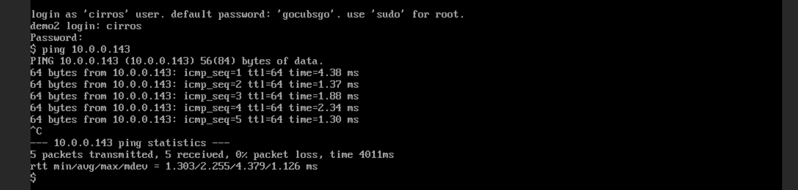
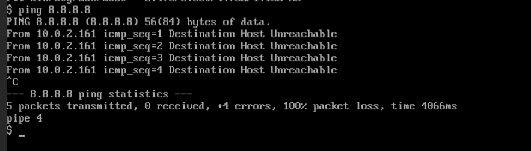
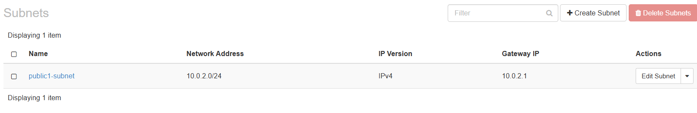
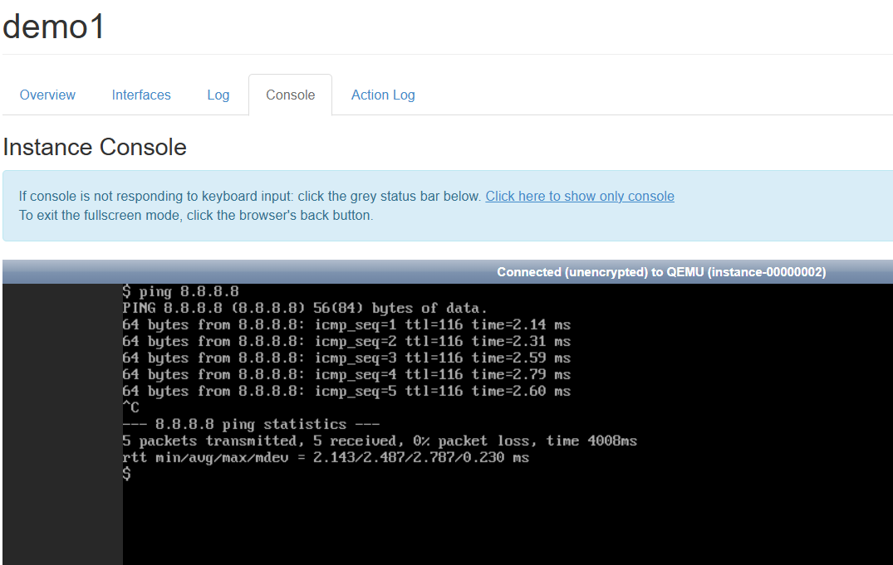
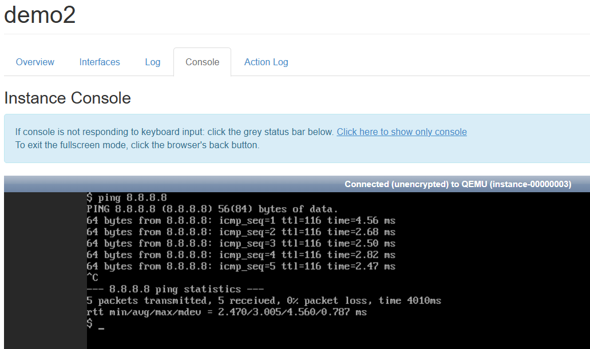

# OpenStack Deployment with Kolla-Ansible on 2 Virtual Machines

This exercise aims to:
1. Deploy OpenStack on two virtual machines using Kolla-Ansible
2. Launch two virtual machines within OpenStack and ensure they can ping each other
3. Configure internet access for the VMs using NAT


## Creating Virtual Machines

To deploy OpenStack, we need two virtual machines.
We will create the following VMs:
1.  **Control Node**: The main machine where OpenStack services will be installed
    - **Resources**: 12 GB RAM, 1 CPU, 20 GB Disk
2.  **Compute Node**: Provides computing resources managed by the control node
    - **Resources**: 2 GB RAM, 1 CPU, 20 GB Disk


## Connecting to Virtual Machines

Once the VMs are created, connect to them via SSH.

In this guide:
- **Compute Node IP**: `10.119.68.144`
- **Control Node IP**: `10.119.70.39`
- **The default user**: `ubuntu`

```bash
ssh ubuntu@10.119.68.144  # Compute Node
ssh ubuntu@10.119.70.39   # Control Node
```

## Switching to Root User

On both machines, switch to the root user

```bash
sudo -i
```

## Configuring passwordless SSH Access

To allow Ansible to connect without prompting for passwords, set up SSH key-based authentication from the control node to itself and the compute node

1. Generate an SSH key on both control and compute nodes
```bash
ssh-keygen
```
Press Enter for all prompts to accept the default options.

2. Add the control node public key to authorized keys on the control node:
```bash
cat .ssh/id_rsa.pub >> .ssh/authorized_keys
```

3. Add the compute node public key to authorized keys on the control node:
```bash
COMPUTE_PUB_KEY=<insert your public key>

echo $COMPUTE_PUB_KEY >> .ssh/authorized_keys
```

4. Verify passwordless SSH access (from the control node):
```bash
ssh root@10.119.68.144  # Compute Node
ssh root@10.119.70.39   # Control Node
```
If successful, SSH should not prompt for a password.


## Disabling and Removing Firewalld

Since `firewalld` may interfere with OpenStack, it should be removed from both VMs:

```bash
apt purge -y firewalld
```

## Installing `kolla-ansible`

Installation follows the official guide: [Kolla-Ansible Quickstart](https://docs.openstack.org/kolla-ansible/2024.1/user/quickstart.html)

### Installing Dependencies

1. Update package index 
```bash
sudo apt update
```

2. Install required dependencies:
```bash
sudo apt install -y git python3-dev libffi-dev gcc libssl-dev python3-pip
```

### Installing PIP and Ansible

Although the official guide recommends using a virtual environment, our virtual machines are dedicated solely to this deployment, so we will install the packages system-wide

1. Upgrade pip to the latest version:
```bash
pip install -U pip
```

2. Install Ansible:
```bash
pip install 'ansible-core>=2.15,<2.16.99'
```

### Installing Kolla-Ansible

Install Kolla-Ansible from the OpenDev repository:
```bash
pip install git+https://opendev.org/openstack/kolla-ansible@stable/2024.1
```

### Preparing Kolla Configuration

1. Create the `/etc/kolla` directory
```bash
sudo mkdir -p /etc/kolla
```

2. Set proper permissions:
```bash
sudo chown $USER:$USER /etc/kolla
```

3. Copy the configuration files (`globals.yml` and `passwords.yml`) to `/etc/kolla`:

```bash
cp -r /usr/local/share/kolla-ansible/etc_examples/kolla/* /etc/kolla
```


## Preparing Inventory

### Copy the default inventory files to the current directory
```bash
cp /usr/local/share/kolla-ansible/ansible/inventory/* .
```
For this guide, we will use the `multinode` inventory.
Kolla-Ansible provides two inventory examples:
-  `all-in-one` – for deploying OpenStack on a single node (localhost)
-  `multinode` – for deploying OpenStack across multiple nodes

---


### Install Ansible Galaxy dependencies
```bash
kolla-ansible install-deps
```


## Inventory Configuration

### Modify `/etc/hosts`

Add hostnames for VMs to `/etc/hosts`

```bash
10.119.70.186 compute01
10.119.69.203 control01
```

### Modify `multinode` inventory

1. In `[control]` section, keep only `control01`
2. In `[network]` section, keep only `control` and rename it to `[network:children]`
3. In `[compute]` section, keep only `control01` and `compute01`
4. In `[monitoring]` section, remove all entries
5. In `[storage]` section, remove all entries
6. The rest leave unchanged

### Verify Ansible connectivity:
Once the inventory is configured, test connectivity between nodes using Ansible:
```bash
ansible -i multinode all -m ping
```
If everything is set up correctly, all nodes should respond with "pong".


## Kolla configuration

### Setting up passwords

Kolla-Ansible stores all deployment passwords in the `/etc/kolla/passwords.yml` file. By default, these passwords are empty and must be generated manually or automatically:

```bash
kolla-genpwd
```

### Configuring `globals.yml`

1. Set the base operation system:
```yaml
kolla_base_distro: "ubuntu"
```

2. Set the internal virtual IP (VIP) for OpenStack services (use the control node IP):
```yaml
kolla_internal_vip_address: "10.119.70.39"
```

3. Specify the network interface used for internal communication (should be the main network interface of the control node):
```yaml
network_interface: "ens3"
```

4. Configure the external network interface for Neutron (we will create this virtual interface later):
```yaml
neutron_external_interface: "veth0"
```

5. Disable HAProxy *(as in the task specification)*:
```yaml
enable_haproxy: "no"
```


## Creating a virtual interface

Kolla-Ansible requires an external interface for Neutron networking. Since our VMs do not have a dedicated physical interface for this purpose, we will create a virtual Ethernet (veth) pair

Reference: [Netplan veth peer links](https://askubuntu.com/questions/1054034/netplan-how-to-describe-veth-peer-links)

---

### Define the virtual interface
Create a systemd network configuration file for the virtual interface

```bash
sudo tee /etc/systemd/network/25-veth-b1b2.netdev <<EOF
[NetDev]
Name=veth0
Kind=veth

[Peer]
Name=veth1
EOF
```

### Add interfaces to Netplan

Modify `/etc/netplan/50-cloud-init.yaml` to include veth0 and veth1


```yaml
network:
    version: 2
    ethernets:
        ens3:
            dhcp4: true
            match:
                macaddress: fa:16:3e:a2:a5:0f
            set-name: ens3
        veth0: {}
        veth1: {}
```

### Apply settings

```bash
netplan generate
netplan apply
```

# Deployment

1. Install necessary dependencies on all target nodes
```bash
kolla-ansible -i ./multinode bootstrap-servers
```

2. Ensure all nodes meet the requirements before deployment
```bash
kolla-ansible -i ./multinode prechecks
```

3. Deploy OpenStack
```bash
kolla-ansible -i ./multinode deploy
```

When this playbook finishes, OpenStack should be functional.


# Using OpenStack

## Setting up the OpenStack CLI

### Install the OpenStack CLI
```bash
pip install python-openstackclient -c https://releases.openstack.org/constraints/upper/2024.1
```

### Generate the admin login credentials
```bash
kolla-ansible post-deploy
```
This will generate `/etc/kolla/cloud.yaml`, which contains admin credentials.

### Set environment variables
```bash
export OS_CLIENT_CONFIG_FILE=/etc/kolla/clouds.yaml
export OS_CLOUD=kolla-admin
```
`OS_CLIENT_CONFIG_FILE` specifies the cloud configuration file with admin credentials
`OS_CLOUD` defines the cloud name to be used for authentication

### Initialize the OpenStack environment
Create default networks, images, and other resources:
```bash
/usr/local/share/kolla-ansible/init-runonce
```

## Creating demo virtual machines 

### Create VM `demo1`

```bash
openstack server create \
    --image cirros \
    --flavor m1.tiny \
    --key-name mykey \
    --network demo-net \
    demo1
```

### Create VM `demo2`

```bash
openstack server create \
    --image cirros \
    --flavor m1.tiny \
    --key-name mykey \
    --network demo-net \
    demo2
```

### Testing connectivity

Now log into your OpenStack and access the consoles of two created VMs and try to ping:

1. From `demo1` to `demo2`

```bash
ping 10.0.0.49
```


2. From `demo2` to `demo1`

```bash
ping 10.0.0.143
```



If both pings are successful, the VMs are correctly configured.


### Check internet access

Since internet access is not set up yet, we will face the error `Destination Host Unreachable` when trying to ping Google's DNS server `8.8.8.8`

```bash
ping 8.8.8.8
```




# Setting up internet access

Perform these steps on the control node

## Enable IP Forwarding
```bash
echo 1 > /proc/sys/net/ipv4/ip_forward
```


## Checking OpenStack Networks

In the OpenStack configuration, we can see a network with the following settings:
- Network address -  `10.0.2.0/24`
- Gateway IP - `10.0.2.1`



Using that information, we can set up the virtual network

### Assign an IP address to the virtual network `veth1`:
```bash
ip addr add 10.0.2.1/24 brd 10.0.2.255 dev veth1
```

### Enable NAT:
```bash
iptables -t nat -A POSTROUTING -s 10.0.2.0/24 -j MASQUERADE
```

## Testing connectivity

Try pinging Google's DNS server again:
```bash
ping 8.8.8.8
```
If ping is successful, the internet access is correctly configured.



